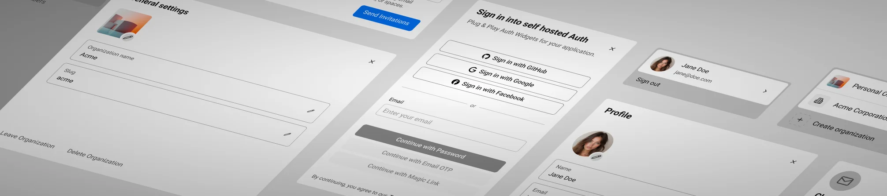

  <picture>
    <source srcset="../bannerDark.webp" media="(prefers-color-scheme: dark)">
    <source srcset="../banner.webp" media="(prefers-color-scheme: light)">
    
  </picture>
  <h2 align="center">
    Auth
  </h2>

  

    Self-owned Plug & Play Auth widgets for your application
     
    <a href="https://etesie.dev/docs/auth/01-getting-started"><strong>Learn more »</strong></a>
     
     
    <a href="https://etesie.dev">Website</a>
    ·
    <a href="https://github.com/mmailaender/auth/issues">Issues</a>
  

## About the Project

**Auth** provides self-owned, plug-and-play authentication widgets for your **React** or **SvelteKit** application.  
It builds on **Better Auth** as the security API layer and **Convex** as the backend, and wraps them with a design system that delivers ready-to-use, customizable components.

- **You own the code** – full control, no vendor lock-in
- **Self-hosted** – get up and running in just 15 minutes
- **Design system included** – adapt the UI to your brand, consistently
- **Polished UX and UI**
  - Optimized for Firefox, Chrome, Safari, Android, and iOS
  - Examples include smooth dialog transitions (e.g. back-swipe on mobile or desktop back button closing user and organization dialogs)

## Why Auth

Authentication and Authorization became easy to add - but hard to truly own.  
In recent years, hosted providers made auth integration simple - but at the cost of control.  
Auth takes the same ease of use and puts you back in charge:

- **You own the code.**  
  With hosted solutions, if a feature is missing or you dislike a part of the UI, you’re stuck rebuilding components from scratch and wiring their API.  
  With Auth, you own the components. Often, making a change is as simple as editing a single line in the code you already control.

- **Your user data stays with you.**  
  Hosted providers duplicate user data on their servers and yours, doubling the attack surface and increasing the risk of data breaches.  
  With Auth, all user data is stored only in your Convex database—nothing is mirrored elsewhere.

- **You control the costs.**  
  Hosted providers typically charge per user or per organization. That can get expensive fast, or even block certain business models.  
  Imagine building a Facebook-style groups feature and having to pay up to $1 per group, per month because every group counts as an “organization.”  
  With Auth, there’s no per-user or per-org pricing. You get the components for free and host them on your own Convex instance.
